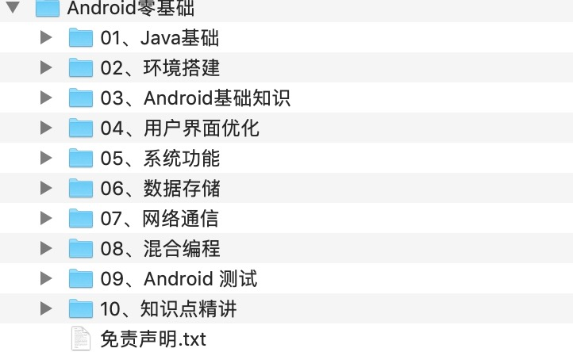
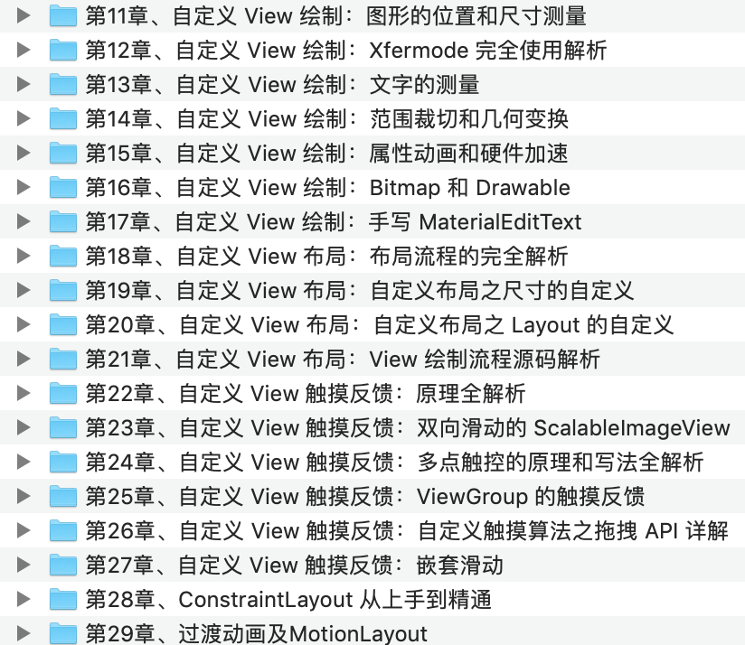
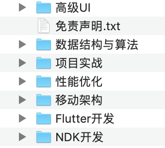
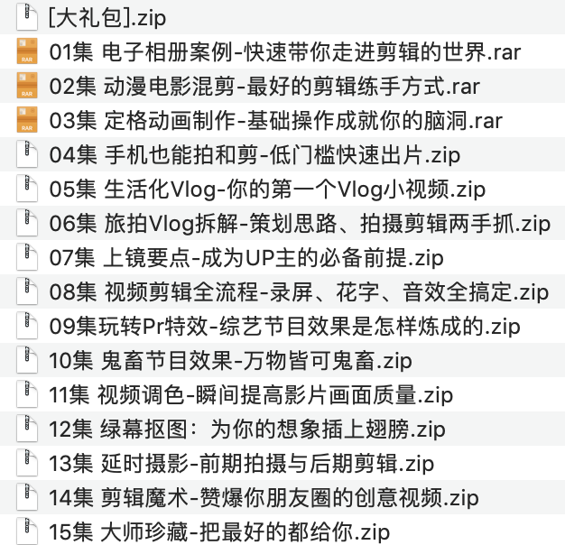

### Android








### Java学习:

```
├──1-1 openjdk编译调试、java线程模型.mp4  263.41M
├──1-2 openjdk编译调试、java线程模型（2）.mp4  46.84M
├──2-1 Java 当中的锁事（1）.mp4  562.55M
├──2-2 Java 当中的锁事（2）.mp4  31.08M
├──3-1 synchronized和volatile关键字（1）.mp4  328.53M
├──3-2 synchronized和volatile关键字（1）.mp4  10.57M
├──4 并发编程之并发容器（1）.mp4  345.82M
├──5-1 并发中锁的原理.mp4  595.13M
├──5-2 并发中锁的原理.mp4  31.95M
├──6-1 JAVA锁膨胀的过程.mp4  549.60M
├──6-2 JAVA锁膨胀的过程.mp4  56.41M
├──7-1 锁的膨胀过程二.mp4  378.22M
├──7-2 锁的膨胀过程二.mp4  63.22M
├──8 并发编程之线程池.mp4  344.62M
├──9-1 CAS和AQS的应用和原理.mp4  542.98M
├──9-2 CAS和AQS的应用和原理（2）.mp4  4.74M
├──10-1 AQS系列一ReentrantLock源码.mp4  575.07M
├──10-2 AQS系列一ReentrantLock源码.mp4  42.00M
├──11-1 AQS解锁过程.mp4  602.09M
├──11-2 AQS解锁过程.mp4  45.57M
├──12-2 读写锁加锁过程.mp4  49.06M
├──13-1 java内存模型.mp4  504.58M
├──13-2 java内存模型.mp4  41.07M
├──14-1 Akka入门与基本功能使用.mp4  773.86M
├──14-2 Akka入门与基本功能使用.mp4  65.56M
├──15-1 Akka高级功能使用.mp4  868.44M
├──15-2 Akka高级功能使用.mp4  61.57M
├──16-1 Dcoker简介、镜像与容器操作等.mp4  451.12M
├──16-2 Dcoker简介、镜像与容器操作等.mp4  11.47M
├──17-1 Dockerfile详解.mp4  474.14M
├──17-2 Dockerfile详解.mp4  24.32M
├──18-1 Compose与Dockerfile，Compose配置文件.mp4  454.36M
├──18-2 Compose与Dockerfile，Compose配置文件.mp4  16.64M
├──19-1 K8S应用讲解.mp4  487.08M
├──19-2 K8S应用讲解.mp4  27.01M

├──20-1 NIO应用讲解（一）.mp4  568.63M
├──20-2 NIO应用讲解（一）.mp4  41.05M
├──21-1 NIO应用讲解（二）.mp4  573.37M
├──21-2 NIO应用讲解（二）.mp4  16.49M
├──22-1 NIO应用讲解（三）.mp4  656.78M
├──22-2 NIO应用讲解（三）.mp4  14.08M
├──23-1 netty应用（—）.mp4  621.79M
├──23-2 netty应用（—）.mp4  24.72M
├──24-1 netty应用（二）.mp4  592.87M
├──24-2 netty应用（二）.mp4  29.22M
├──25-1 netty源码（一）.mp4  694.28M
├──25-2 netty源码（一）.mp4  40.34M
├──26-1 netty源码（二）.mp4  724.14M
├──26-2 netty源码（二）.mp4  42.76M
├──27-1 netty源码（三）.mp4  700.76M
├──27-2 netty源码（三）.mp4  18.58M
├──28 netty源码（四）.mp4  930.46M
├──29 netty源码（五）.mp4  1010.09M

├──30 netty源码（六）(1).mp4  936.69M
├──30 netty源码（六）.mp4  936.69M
├──31 netty源码（七）(1).mp4  1.04G
├──31 netty源码（七）.mp4  1.04G
├──33 Mybatis应用1.mp4  970.90M
├──34 mybatis源码2.mp4  1005.14M
├──35 mybatis 一级缓存&二级缓存源码解析.mp4  1022.74M
├──36 mybatis插件原理及编写.mp4  1.11G
├──37 mybatis日志原理1.mp4  1.01G
├──38 mybatis总结+面试.mp4  1009.49M
├──39 spring 应用（一）.mp4  1.01G

├──40 spring 应用（二）.mp4  962.76M
├──41 动态代理源码分析.mp4  1.07G
├──42 beanDefiniton (一）源码分析.mp4  1.08G
├──43 beanDefiniton (二）源码分析.mp4  1.11G
├──44 beanFactoryPostProcessor 源码分析（一）.mp4  1.13G
├──45 beanFactoryPostProcessor 源码分析（二）.mp4  1.02G
├──46 @MapperScan 原理分析.mp4  956.47M
├──47 CGLib 原理分析.mp4  1.13G
├──48 循环依赖.mp4  1.12G
├──49 spring aop (一）.mp4  1.04G

├──50 spring aop (二）.mp4  1.02G
├──51 spring 推断构造方法原理（一）.mp4  1.04G
├──52 spring 推断构造方法原理（二）.mp4  986.27M
├──53 spring生命周期之后置处理器（一）.mp4  1.02G
├──54 spring生命周期之后置处理器（二）.mp4  934.65M
├──55 spring mvc 应用+手写模拟Spring MVC.mp4  1.03G
├──56 spring mvc 零xml配置原理.mp4  975.79M
├──57 spring mvc源码（一）.mp4  978.32M
├──58 spring mvc源码（二）.mp4  1.08G
├──59 spring生命周期之后置处理器（三）.mp4  983.17M

├──60 spring生命周期之后置处理器（四）.mp4  986.23M
├──61 spring生命周期之后置处理器（五）.mp4  980.64M
├──62 spring boot应用（一）.mp4  958.29M
├──63 spring boot应用（二）.mp4  994.82M
├──64 spring boot监听器.mp4  1.04G
├──65 Spring Boot 内嵌服务器.mp4  981.08M
├──66 Spring boot 热部署原理.mp4  1.02G
├──67 Spring boot 启动类源码.mp4  1.07G
├──68 elasticsearch入门介绍安装与基本api的使用.mp4  955.49M
├──69 elasticsearch高级查询及搜索系统实战.mp4  979.01M

├──70 elasticsearch api操作.mp4  1.05G
├──71 redis入门介绍安装及配置文件持久化.mp4  996.90M
├──72 redis基本api。事务。缓存失效策略.mp4  1.05G
├──73 redis主从复制与哨兵模式.mp4  1.01G
├──74 rediscluster集群.mp4  976.67M
├──76 rediscluster高可用集群（缓存雪崩）.mp4  1.00G
├──75 此节忽视   
├──77 rediscluster&redis分布式锁.mp4  924.51M
├──78 redis事务&删除策略&淘汰策略&缓存击穿.mp4  988.90M
├──79 redis主从复制与哨兵模式.mp4  959.89M

├──80 JDK7与JDK8中的HashMap源码解析.mp4  892.78M
├──81 JDK7中ConcurrentHashMap源码解析.mp4  1.10G
├──82 JDK8中ConcurrentHashMap源码解析.mp4  1.02G
├──83 Tomcat架构解析与请求处理流程概要讲解.mp4  1.09G
├──84 Tomcat中自定义类加载器源码解析.mp4  1.17G
├──85 Tomcat启动过程与组件的生命周期源码解析.mp4  1.02G
├──86 Tomcat请求处理流程源码解析（1）.mp4  920.10M
├──87 Tomcat请求处理流程源码解析（2）.mp4  1.10G
├──88 Tomcat中关于Session和Jsp功能的源码解析.mp4  1.12G
├──89 mysql中profile命令使用与详解.mp4  1.16G

├──90 hash算法详解、java当中hashmap源码解析.mp4  1.03G
├──91 从源码理解hashmapJDK7和JDK8的变化.mp4  1.13G
├──92 Tomcat中nio处理请求源码实现与异步.mp4  1001.89M
├──93 Tomcat中自定义类加载器的使用与源码实现.mp4  1.19G
├──94 请求在容器中的处理与启动过程源码实现.mp4  1.29G
├──95 请求在容器中的处理与启动过程源码实现.mp4  1.02G
├──96 Eureka&Eureka源码（二-1).mp4  997.92M
├──97 Eureka&Eureka源码（二-2）（1）.mp4  1.03G
├──98 Eureka&Eureka源码（三)（1）.mp4  1.03G
└──99 Eureka client 源码解析（1）.mp4  1.03G

├──100 Ribbon源码解析（1）.mp4  1.00G
├──101 Ribbon源码解析（1）.mp4  951.90M
├──102 hystrix源码（1）.mp4  968.90M
├──103 spring cloud getway 应用（1）.mp4  1.00G
├──104 Apollo应用（1）.mp4  931.46M
├──105 nacos应用（1）.mp4  1019.75M
├──106 nacos集群&Sentinel（1）.mp4  937.71M
├──107 sentinel应用(二)（1）.mp4  894.33M
├──108 sentinel持久化（1）.mp4  955.81M
├──109 Nginx-Nginx简介安装和配置（1）.mp4  941.44M

├──110 Nginx-Nginx反向代理和动静分离（1）.mp4  770.11M
├──111 Nginx-Nginx高可用配置（1）.mp4  753.84M
├──112 RocketMq-RocketMQ快速入门、集群部署.mp4  995.46M
├──113 RocketMQ事物消息批量发送消息广播模式.mp4  841.65M
├──114 消息生产者消息消费者有序生产者顺序消费.mp4  924.22M
├──115 MongoDB入门介绍与应用场景（1）.mp4  891.06M
├──116 MongoDB索引介绍、全文索引、复合索引.mp4  852.21M
├──117 Zookeeper快速入门与基本使用介绍（1）.mp4  1.50G
├──118 Zookeeper高级功能使用与客户端框架（1）.mp4  1.77G
├──119 Zookeeper单机模式下RequestProcessor源码解析.mp4  1.13G

├──120 Zk单机模式客户端发送数据流程源码解析.mp4  2.24G
├──121 Wc注册与触发机制Session跟踪机制源码解析.mp4  1.01G
├──122 Session跟踪机制源码解析（1）.mp4  1.55G
├──123 Zookeeper集群介绍与ZAB协议解析（1）.mp4  943.42M
├──124 Zookeeper中快速领导者选举算法源码解析.mp4  1.92G
├──125 Zk算法源码解析（2）与 两阶段提交源码解析.mp4  2.38G
├──126 Zookeeper中数据同步机制源码解析（1）.mp4  1.80G
├──127 Paxos算法、Raft算法原理解析（1）.mp4  1017.10M
├──128 Dubbo框架介绍与手写模拟Dubbo（1）.mp4  782.77M
├──129 Dubbo的基本应用与高级应用（1）.mp4  1.10G

├──130 Dubbo的可扩展机制SPI源码解析（1）.mp4  1.16G
├──131 Dubbo整合Spring源码解析（1）.mp4  1.02G
├──132 Dubbo服务调用源码解析（1）.mp4  1.20G
├──133 Dubbo服务引入源码解析（1）.mp4  1.10G
├──134 Dubbo服务调用源码解析（1）.mp4  1.18G
├──135 seata基本安装和基本使用（1）.mp4  959.67M
├──136 seata源码(一)（1）.mp4  762.39M
├──137 seata源码(二）（1）.mp4  1005.87M
├──138 seata源码(三）（1）.mp4  1005.67M
├──139 seata源码(四）（1）.mp4  1007.89M
├──140 seata源码(五）（1）.mp4  960.21M
├──141 mycat分库分表实战（1）.mp4  942.60M
├──142 mycat高可用集群（1）.mp4  938.34M
├──143 中国互联网发展与商城架构详解  
|   └──中国互联网发展与商城架构详解(1).mp4  1.03G
├──144 商品中心与订单业务实战详解  
|   └──商品中心与订单业务实战详解(1).mp4  1.65G
├──145 商城扫码支付后台实战  
|   └──商城扫码支付后台实战(1).mp4  2.12G
├──146 安全认证Spring Oauth2实战  
|   └──安全认证Spring Oauth2实战(1).mp4  2.20G
├──147 电商微服务架构以及服务拆分实战  
|   └──电商微服务架构以及服务拆分实战(1).mp4  1.29G
├──148 秒杀系统多级缓存实战以及压力测试  
|   └──秒杀系统多级缓存实战以及压力测试(1).mp4  1.39G
├──149 高并发环境下的库存扣减  
|   └──高并发环境下的库存扣减(1).mp4  1.22G
├──150 高并发环境下订单处理  
|   └──高并发环境下订单处理(1).mp4  1.26G
├──151 分布式ID实战  
|   └──分布式ID实战(1).mp4  585.35M
├──152 DevOps实战  
|   └──DevOps实战(1).mp4  1013.51M
```


### 视频剪辑




需要请添加qq: 1442949811，请填写需要的资料名称，内容自己都看了一遍

